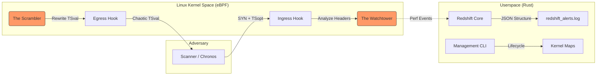

# Redshift

```text
    ____  __________  _____ __  ______________
   / __ \/ ____/ __ \/ ___// / / /  _/ ____/ /_
  / /_/ / __/ / / / /\__ \/ /_/ // // /_  / __/
 / _, _/ /___/ /_/ /___/ / __  // // __/ / /_
/_/ |_/_____/_____//____/_/ /_/___/_/    \__/

```

> **"Reality is merely an illusion, albeit a very persistent one."**
> — *Albert Einstein*

---

## 🌑 Introduction

**Redshift** is a kernel-resident active defense framework designed to neutralize remote physical device fingerprinting.

In the domain of advanced surveillance, attackers utilize **Clock Skew Fingerprinting** to identify devices based on the microscopic, physical imperfections of their quartz crystal oscillators. Tools like *Chronos-Track* can bypass VPNs, NATs, and MAC randomization by measuring the drift of TCP timestamps over time.

Redshift leverages **eBPF (Extended Berkeley Packet Filter)** to intercept traffic at the Linux kernel boundary. It injects nanosecond-precision entropy into the TCP stack, mathematically decoupling the host's physical hardware from its network signature without disrupting legitimate communication protocols.

---

## ⚡ Live Defense Simulation

Below is a capture of Redshift neutralizing a high-frequency skew scan initiated by an external adversary.

```text
root@host:~# ./redshift.sh status --live

 [SYSTEM]      eBPF Programs Loaded. Mode: ACTIVE.
 [WATCHTOWER]  Ingress Filter: ARMED on eth0.
 [SCRAMBLER]   Egress Filter:  ARMED. Entropy Injection: ENABLED.

 > [ALERT] INCOMING PROBE DETECTED
   ├─ Source: 203.0.113.42
   ├─ Type:   TCP Timestamp Option (Kind 8)
   └─ Action: FLAGGED for Forensic Log

 < [MITIGATION] OUTGOING RESPONSE INTERCEPTED
   ├─ Original TSval: 34910284 (Linear Drift)
   ├─ Shifted TSval:  88291023 (Randomized)
   ├─ Checksum:       Recalculated (0xA4F2 -> 0x1B3D)
   └─ Verdict:        SENT

 [STATUS] Threat neutralized. R² dropped to 0.0000.

```

---

## 🔬 The Physics of Deception

> **"Hardware never lies, until we teach it to."**

Remote fingerprinting relies on the assumption that a host's TCP timestamp updates are linearly correlated with its physical uptime. Attackers model this relationship using linear regression:

Where:

*  is the target's timestamp.
*  represents the unique clock skew (ppm).
*  (Coefficient of Determination) represents the reliability of the fingerprint.

**Redshift breaks this fundamental assumption.**

By introducing a stochastic variable  into the egress path via the `clsact` qdisc, Redshift forces the correlation coefficient to collapse:

* **Baseline (Unprotected):**  (Stable Physical Signature)
* **Redshift Active:**  (Chaotic/Virtual Signature)

This forces the attacker's regression model to fail, misclassifying a high-value workstation as a low-fidelity IoT device or a noisy virtual honeypot.

---

## 🛠️ System Architecture

Redshift operates as a "Man-in-the-Middle" within the Linux Kernel itself. It uses a split-binary architecture consisting of high-performance kernel classifiers and Rust-based userspace loaders.



### Functional Modules

| Module | Layer | Function |
| --- | --- | --- |
| **The Watchtower** | **TC Ingress** | Deep packet inspection for high-frequency Timestamp probing. Emits perf events to userspace for forensic analysis. |
| **The Scrambler** | **TC Egress** | Intercepts outgoing TCP packets. Overwrites `TSval` with `bpf_get_prandom_u32()` and fixes L4 checksums (`bpf_csum_diff`). |
| **Redshift Core** | **Userspace** | Built on **Aya** and **Tokio**. Manages eBPF lifecycle, handles async logging, and generates reports. |

---

## 🚀 Usage

### Prerequisites

* Linux Kernel 5.15+ (BTF support required)
* Rust (Nightly toolchain)
* Root privileges (required for TC attachment)

### 1. Build the Singularity

Compiles both the eBPF bytecode (kernel) and the Rust loaders (userspace).

```bash
./redshift.sh build

```

### 2. Engage Distortion Field

Attaches the classifiers to the network interface and begins entropy injection.

```bash
sudo ./redshift.sh start eth0

```

### 3. Verification & Status

Checks process health, PID tracking, and active detection counters.

```bash
./redshift.sh status

```

### 4. Forensic Report

Generates a professional HTML security audit report from the accumulated JSON logs.

```bash
./redshift.sh export
explorer.exe redshift_report.html

```

---

## 🛡️ Forensic Logging

Redshift maintains a persistent audit trail. Logs are stored in structured JSON format, serving as a "Source of Truth" for security audits.

**Sample Log Entry (`redshift_alerts.log`):**

```json
{
  "timestamp": 1771419280,
  "source_ip": "192.168.1.50",
  "event_type": "TCP_CLOCK_SKEW_SCAN",
  "mitigation": "TS_RANDOMIZATION",
  "severity": "HIGH",
  "verdict": "NEUTRALIZED"
}

```

---

## ⚠️ Disclaimer

Redshift alters TCP headers at the kernel level. While it maintains checksum validity (RFC 793), it intentionally violates TCP Timestamp Monotonicity (RFC 7323) to achieve privacy goals. Use with caution in environments sensitive to RTT measurement (e.g., high-frequency trading).

**Built for the shadows.**

```

```